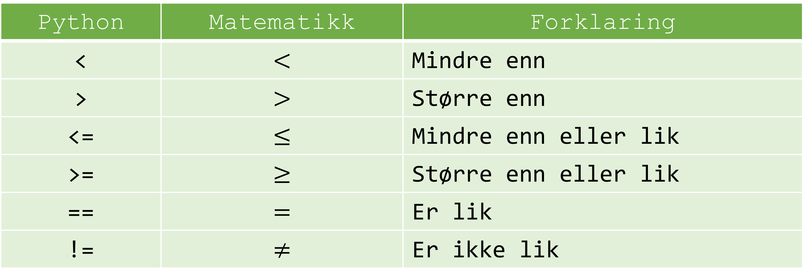

# If-setninger og Betingelser i Python

## Forklaring

`if`-setninger i Python brukes til å teste en spesifikk betingelse og utføre kode basert på om betingelsen er sann eller usann. For å utføre mer komplekse betingede tester kan man også bruke `elif` (som står for "else if") og `else`. Når vi sammenlikner ulike datatyper og størrelser er det greit å vite om hvilke ulike sammenlikningstegn vi har:



## Eksempler

1. **Enkel if-setning**:

```Python
alder = 18
if alder >= 18:
    print("Du er voksen!")
```

2. **If-else-setning**:

```Python
alder = 16
if alder >= 18:
    print("Du er voksen!")
else:
    print("Du er mindreårig!")
```

3. **If-elif-else-setning**:

```Python
alder = 16
if alder >= 18:
    print("Du er voksen!")
elif alder >= 13:
    print("Du er tenåring!")
else:
    print("Du er barn!")
```

## Oppgave

Kopier koden under.

```Python
alder = int(input("Hvor gammel er du? "))
```

Bruk if-setninger til å lage tilpassede tilbakemeldinger basert på hva inputen blir.
Du skal bruke både if, elif og else i programmet.

Programmet skal fungere slik at det spør om alderen til brukeren og skriver ut ulike svar slik som beskrevet under.

Om alderen er under 20:

```
Young and handsome!
```

Om alderen er mellom 20 og 40:

```
Still looking good!
```

Om alderen er mellom 40 og 60:

```
Is that a wrinkle?
```

Om alderen er over 60:

```
You're getting old!
```
